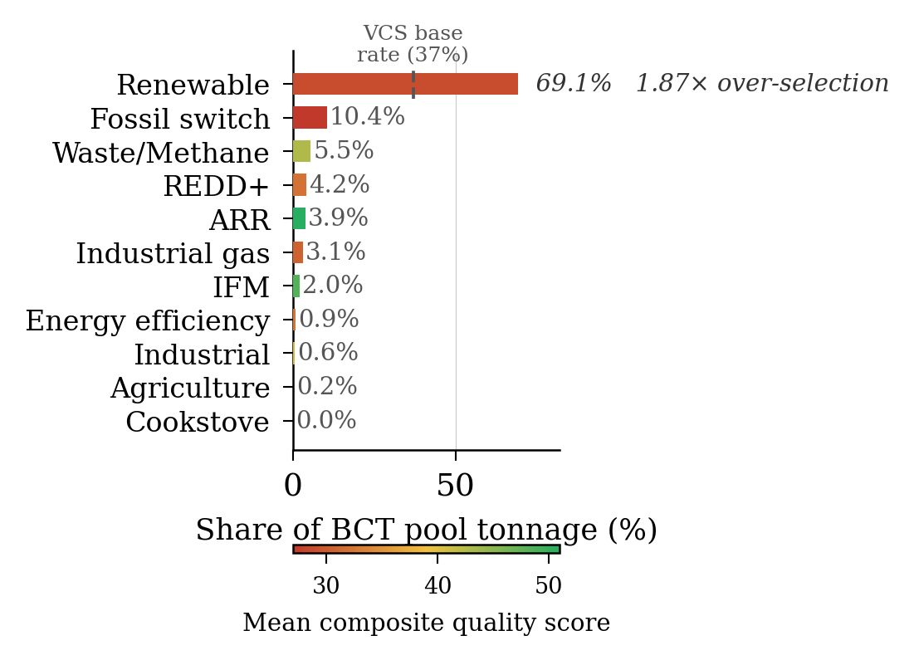
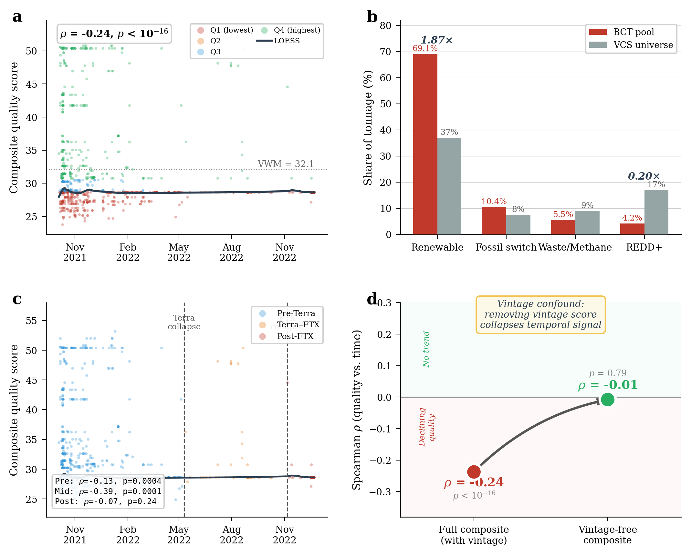
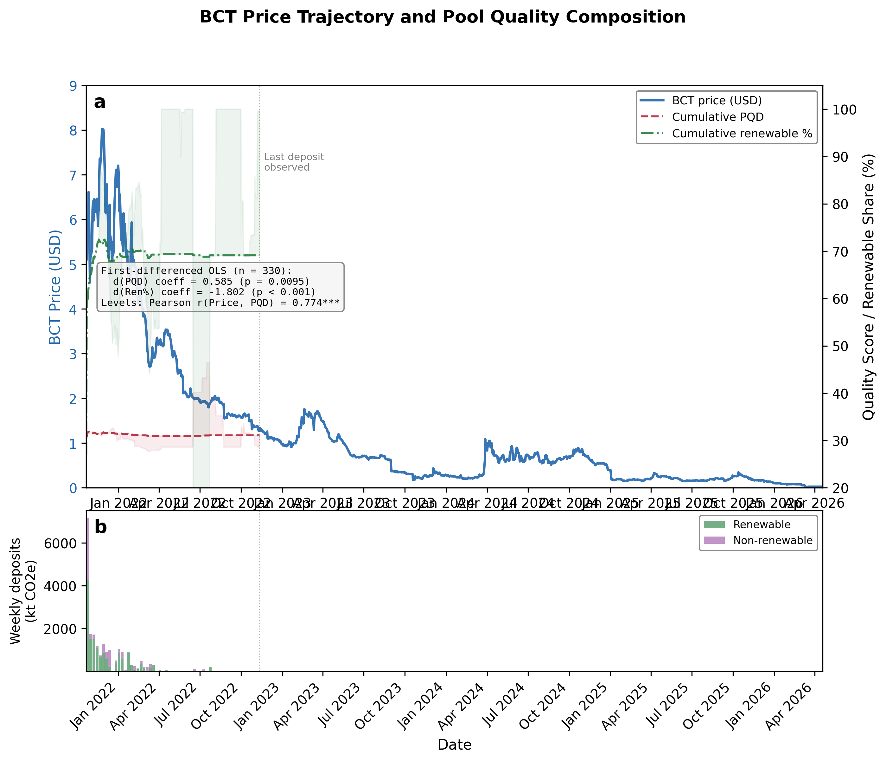

# 研究进展报告

**项目**：链上取证分析代币化碳信用市场的逆向选择

---

## 这个项目在做什么

简单说，我在研究全球第一个代币化碳信用池为什么崩了。

碳信用就是"减排凭证"，一个项目减排了 1 吨 CO₂ 就能拿到 1 个碳信用，企业买来抵消自己的排放。但不同碳信用的质量差很多，有的代表真实的减排（比如保护一片本来要被砍掉的雨林），有的其实就是给本来就会建的风电场发了个证（学术上叫额外性为零）。

2021 年 Toucan Protocol 在 Polygon 区块链上做了一个叫 BCT 的碳信用池。机制很直接：任何人把碳信用存进去，拿到等量的 BCT 代币。想取碳信用出来？花同等数量的 BCT 代币就行。核心问题是**不管存什么进去都是同一个价格**，相当于把质量完全不同的东西混到一个池子里统一卖。

BCT 从 2021 年底大约 $7 跌到 2023 年不到 $0.50。行业里一直传的说法是"都是低质量的 REDD+（森林保护）项目搞的"，因为 REDD+ 项目质量差在学术界确实是个公认问题（West et al., Science 2023 发现巴西 REDD+ 项目平均高估减排 5.7 倍）。但**从来没人真的去链上查过 BCT 到底装了什么**。之前所有分析 BCT 的文献（Bosshard et al. 2025, Jirasek 2023 等）用的全是聚合市场数据。

所以我做的事情是：**把 BCT 链上每一笔存款、每一笔赎回、每一个钱包地址全拉出来分析**。1,187 笔存款、35,432 笔赎回、509 个存款钱包、28,897 个赎回钱包、168 个 VCS 项目、大约 2,200 万吨碳信用。

---

## 主要发现

### 发现 1：行业叙事是错的

拉完链上数据一看，BCT 里根本不是 REDD+。**69.1% 是可再生能源信用**，主要来自 2008 到 2013 年的中国风电和印度光伏。这些项目属于 CDM 时代遗留下来的，Cames et al. (2016) 和 Schneider et al. (2010) 早就论证过这类项目额外性基本为零，中国电网风电 2010 年就已经盈利了，有没有碳信用它都会建。

REDD+ 实际只占 **4.2%**，比行业以为的少了 16 倍。

下面这张图直接看得到，可再生能源那个红色的条远远拉开了其他所有类型，灰色竖线是 VCS 注册库的基线比例（37%）：

这个发现本身我觉得就挺有意思。一个被讨论了好几年的"REDD+ 导致 BCT 崩溃"的说法，结果链上数据一查就推翻了。说明之前的人确实是在没查数据的情况下直接套用了 REDD+ 质量差这个现成的叙事。

### 发现 2：这个偏差不是随机的

BCT 里可再生能源占 69.1%，但整个 VCS 注册库里可再生能源大概只占 37%（数据来自 MSCI 2023 和 Ecosystem Marketplace 2023），选择系数是 1.87 倍。

这里有个统计上需要小心的地方。BCT 的存款是按钱包聚类的，有些大钱包一口气存了好多笔，直接做朴素二项检验会夸大显著性。我用了三种方式处理聚类：钱包级置换检验、HHI 调整有效样本量（从 1,187 降到 83.5）、DEFF 调整（有效样本量 270）。三种方法下全部高度显著，最弱的 HHI 调整下都是 p = 2.9 × 10⁻¹⁵。

上面图的 b 面板比较直观地展示了 BCT 和 VCS 基线的对比（红色 vs 灰色）：

然后一个很关键的问题是：这个偏差是谁造成的？是存款的人故意挑差信用往里放？还是系统本身就这样？

为了搞清楚这个，我去数了 Toucan 桥接工具搬到链上的所有代币，总共 369 种，其中 345 种进了 BCT，只有 24 种没进来。按吨位算的话 BCT 吸收了 21.98M 吨，那 24 种加起来才 86,683 吨，**吨位直通率 99.6%**。基本上桥接过来什么就进去什么，没有任何池子层面的筛选空间。

结论是选择发生在桥接层面，是架构性的。不需要有人故意操纵，池子不设门槛就自然会被最便宜的供给填满。

### 发现 3：价格和质量互相拖累

我从 DeFi Llama 拿了 828 天的 BCT 价格数据，跟链上计算出来的质量指标合并分析（331 天有重叠）。

下面这张图左边的上半部分能直接看到价格（蓝色实线）和质量（红色虚线、绿色点线）的走势：

价格和质量高度相关（Pearson r = 0.774）。更重要的是双向 Granger 因果检验的结果：

- 价格 → 质量方向：F = 16.08，p < 10⁻⁵（很强）
- 质量 → 价格方向：F = 6.32，p = 0.004（显著但弱 2.5 倍）

价格下跌"带坏"质量的力度比质量恶化"拖累"价格的力度更大。逻辑上说得通：价格跌了之后好信用的持有者更不愿意存进来（因为亏本），只剩差信用还在存，质量更差，价格继续跌，恶性循环。

我还特意检验了 BCT 的价格崩溃是不是只是跟着加密市场一起跌的。把 BCT 日收益率跟 ETH 日收益率做了回归，R² 只有 0.04。BCT 的死亡螺旋是它自己的事。

### 发现 4：有人在系统性"淘金"

分析完存款端，接下来看赎回端。规则是花 1 个 BCT 代币可以从池子里取出 1 吨碳信用。如果 BCT 市场价 $2 但你取出的信用在链下市场值 $10，差价就是利润。

我追踪了全部 35,432 笔赎回记录，按信用类型统计赎回率：

| 信用类型 | 存入量 | 赎回量 | 赎回率 |
|----------|--------|--------|--------|
| 工业气体 | 672,255 t | 672,255 t | **100%** |
| REDD+ | 521,889 t | 521,018 t | **99.8%** |
| IFM | 285,367 t | 265,368 t | **93.0%** |
| ARR | 845,104 t | 771,768 t | **91.3%** |
| 可再生能源 | 10,233,697 t | 373,597 t | **3.6%** |

值钱的全被取走了，不值钱的几乎没人碰。

前 5 个赎回钱包总共提取了 155 万吨，链下估计利润 $4-8M。然后我追踪了提取后的去向：39.2% 存进了 NCT（跨池套利），34.6% 直接链上销毁（退役变现），17% 转给了别的地址。

20 个最大赎回者里 15 个从来没存过款。他们不是"存差取好"，而是纯粹来取东西的。

另一个比较重要的发现是存款群体和赎回群体几乎不重叠。509 个存款钱包和 28,897 个赎回钱包之间只有 1.4% 的交集。我还分析了那 1.4% 重叠钱包的质量交换模式，结果质量差异均值是 -0.08，基本是零。不是同一批人在两头操作，而是两个完全不同的群体分别利用了池子的两端。

这个"双边"的结构在经典逆向选择模型里不太常见。Akerlof 的柠檬市场假设的是单一人群，这里是两个独立群体操作同一个机制的不同端。

### 发现 5：同一个信用放进不同池子，结果完全不同

这个我觉得是最 clean 的一个 identification。有 14 种碳信用同时在 BCT（什么都收）和 NCT（只收自然类信用）两个池子里存在。完全一样的东西：

- BCT 里被赎回了 **100%**
- NCT 里只被赎回了 **28.5%**

造林（ARR）信用最极端：BCT 100% vs NCT 0%。同一种信用在 BCT 里是一堆可再生能源里的"稀有品"，有套利价值。在 NCT 里周围都是类似的自然类信用，没有差价可赚。

这个比较的好处是控制住了信用质量本身。同一个代币，唯一的变量就是池子的设计规则。

### 发现 6：DiD 严格检验

一个可能的质疑是"NCT 样本太小所以你看不出来趋势"。一开始确实有这个问题，单独测 NCT 的时间趋势只有 35 个代币，检验力不够。

后来我换了一个思路：与其单独测"NCT 有没有下降"，不如测"BCT 是不是比 NCT 下降得更快"。把两个池子 1,895 笔存款合成一个面板数据做 DiD，以 2022 年 5 月 Terra 崩盘作为外生冲击。

| 方法 | BCT×post-Terra 交互项 | p 值 |
|------|----------------------|------|
| 事件研究 DiD（聚类稳健 SE，349 个聚类）| **-7.33** | **0.004** |
| 置换检验（10,000 次）| -2.57 | **< 0.0001** |
| 贝叶斯 bootstrap（10,000 次）| -2.57 | P(BCT 更差) = **99.98%** |

描述性统计也很直观：Terra 崩盘后 BCT 均质量从 32.1 掉到 29.0，而 NCT 从 39.8 升到 44.1。有门槛的池子在外部冲击下反而改善了。

---

## 理论上的意义

经济学里最经典的市场失败故事是 Akerlof (1970) 的柠檬市场。买家不知道车好不好，卖家知道，结果差车把好车挤出市场。核心假设是信息不对称。

BCT 的情况不一样。区块链上每个碳信用是什么项目、什么年份、什么方法学，全部公开透明。信息不是问题，**问题是机制不让你根据信息做出不同的选择**。池子规则是统一定价，你知道某个信用质量差也没用，出价不能比别的信用低。

| | Akerlof 柠檬市场 | BCT |
|---|---|---|
| 信息 | 私有（卖方知道买方不知道） | 完全公开 |
| 失败原因 | 买方无法区分质量 | 机制不允许差异化定价 |
| 关键概念 | 信息不对称 | 质量不可操作性 |

简单说就是**光透明不够用，你还得让人能根据看到的信息做出不同的经济决策**。这对整个代币化 RWA（约 $100B）领域的机制设计有直接启示。

为了验证这个不只是碳市场的个例，我还分析了以太坊上 Curve Finance 的 stETH/ETH 池。Curve 的 stableswap 也是把两种不同质量的资产按近似 1:1 定价，结构上跟 BCT 很像。2022 年 5 月 Terra 崩盘的时候完全相同的模式出现了：3 周内 380,869 ETH 等值的组成转移（约 $7.62 亿），基线放大 40 倍。

---

## 质量评分框架

因为链上数据只告诉你"什么信用进出了池子"，不直接告诉你"质量好不好"，所以我需要一套评分系统。

设计了 7 个维度的评分（0-100 分）：减排类型层级 25%、额外性 20%、MRV 20%、持久性 17.5%、年份 10%、注册机构质量 7.5%，外加一个不计分的共同效益门槛（有人权或环境风险就一票否决）。权重参考了 Oxford Offsetting Principles 和 ICVCM CCP 框架。

自己设计的评分总要回答一个问题：你这个评分靠谱吗？不是在自说自话吗？

所以做了三种外部验证：

1. **CCP 标签对比**（n=318）：ICVCM 审批通过的信用平均得分比没通过的高 1.99 个等级，Cohen's d = 1.87，分离效果非常强。然后我还做了循环论证检验：去掉权重最大的维度（减排类型 25%），CCP/非CCP 的差距不但没缩小反而保留了 101.4%。说明分离是由额外性、持久性、MRV 共同驱动的。

2. **BeZero 商业评级对比**（n=27，跨 12 种方法学类型）：Spearman ρ = +0.901，100% 在 ±1 级内吻合。比三家商业评级公司之间的互评一致性还高（它们之间平均 ρ 才 0.009）。

3. **LLM 评审员面板**（3 个模型 × 29 个信用）：Fleiss' κ = 0.600，算中等偏上的一致性。权重最大的两个维度（减排类型 κ=0.585，持久性 κ=0.684）一致性最高，框架里负荷最大的维度恰好是最可复现的。

---

## 做了哪些实验

下面是全部实验工作的完整清单。大致按照研究逻辑分成几块。

### A. 数据采集与分类

| # | 实验 | 做了什么 | 数据规模 | 关键结果 |
|---|------|---------|---------|---------|
| 1 | 链上组成分析 | 从 Polygon RPC 提取 BCT 全部存款事件，逐笔与 Verra 注册库交叉比对，分成 11 种方法学类型 | 1,187 笔存款，168 个 VCS 项目 | 69.1% 可再生能源，4.2% REDD+ |
| 2 | NCT 对照组采集 | 同样的方法提取 NCT 池的全部存款，评分并作为对照 | 708 笔存款，35 个代币 | 100% 评分覆盖 |
| 3 | 赎回事件采集 | 提取 345 个 TCO2 代币合约的全部 Transfer 事件，识别从 BCT 池地址发出的赎回 | 35,432 笔赎回，134 个钱包缓存文件 | 完整赎回记录 |

### B. 评分框架

| # | 实验 | 做了什么 | 数据规模 | 关键结果 |
|---|------|---------|---------|---------|
| 4 | 29 信用手工评分（pilot） | 用 7 维度 rubric 对 29 个代表性碳信用逐项打分，生成等级后验分布 | 29 信用 × 7 维度 | 基准评分集 |
| 5 | 方法学原型批量扩展 | 从 29 个手工评分推广到 318 个方法学原型，按类型+年份自动评分 | 318 信用 | 覆盖 17 个方法学类型 |
| 6 | BCT 全覆盖评分 | 对 345 个 BCT 代币全部评分（161 原始 + 184 补充） | 345/345 = 100% | 池内每个代币都有质量分 |
| 7 | CCP 标签验证 | 把我们的评分跟 ICVCM CCP 官方审批标签对比 | 318 信用（165 CCP / 153 非 CCP） | Cohen's d = 1.87 |
| 8 | CCP 循环论证检验 | 去掉权重最大的维度（减排类型 25%），看 CCP/非CCP 差距是否缩小 | 同上 318 信用 | 差距保留 101.4%，不是循环论证 |
| 9 | BeZero 商业评级对比 | 跟 BeZero Carbon 的评级做排名相关，跨 12 种方法学类型 | 27 个配对项目 | Spearman ρ = +0.901 |
| 10 | 三家商业评级交叉比较 | 比较 BeZero、Calyx、Sylvera 三家之间的一致性，以及跟我们的一致性 | 6 个 REDD+ 项目（全配对）+ 扩展集 | 我们和 BeZero 的一致性（0.901）> 商业机构之间的互评（0.009） |
| 11 | LLM 评审员面板 | 3 个 Claude 模型独立评 29 个信用，计算 Fleiss' κ、ICC、逐维度一致性 | 3 模型 × 29 信用 | Fleiss' κ = 0.600，ICC = 0.993 |
| 12 | 多供应商 LLM 复制 | 加入 GPT-5、Gemini 2.5 Pro、Llama 4 Maverick，检验跨供应商一致性 | 5 个模型 | 跨供应商 κ = 0.647（高于 Anthropic 基线） |
| 13 | Gaussian 等级后验验证 | 检验 Gaussian CDF 近似等级概率跟 Monte Carlo 模拟的差距 | 10 个边界信用 | 最大误差 3.69%，均值 1.1% |

### C. 选择偏差与因果识别

| # | 实验 | 做了什么 | 数据规模 | 关键结果 |
|---|------|---------|---------|---------|
| 14 | 基线比较与聚类校正 | BCT 组成 vs VCS 注册库基线，三种聚类校正 | 509 个钱包，3 种基线假设 | 选择系数 1.87×，p < 10⁻¹⁵ |
| 15 | 桥接层吨位验证 | 枚举全部 369 个桥接代币，RPC 查询 24 个非 BCT 的 totalSupply | 369 代币 | 吨位直通率 99.6%，非 BCT 仅 86,683t |
| 16 | KlimaDAO 金库排除 | 检查 KlimaDAO 金库是否能解释 BCT 组成偏差 | KlimaDAO 钱包交叉比对 | 不能解释，偏差在 KlimaDAO 之外也成立 |
| 17 | 零模型基准 | 100,000 次随机分配（保持吨位分布不变，随机打乱质量分），看 BCT 的实际质量是不是比随机差 | 100,000 次置换 | z = -0.64, p = 0.27（池内没有额外的选择偏差，宇宙本身就是低质量的） |
| 18 | Terra/FTX 事件研究 | 以 Terra 崩盘和 FTX 崩盘为外生冲击，看存款质量是否加速恶化 | 三个时期的存款对比 | Pre-Terra ρ=-0.13, Terra-FTX ρ=-0.36（恶化加速 3 倍） |
| 19 | DiD 分析 | BCT+NCT 1,895 笔存款面板，Terra 崩盘为冲击，聚类稳健 SE + 置换 + 贝叶斯 | 1,187+708 存款，349 个聚类 | β₃ = -7.33, p = 0.004 |
| 20 | 同信用跨池比较 | 14 个代币同时在 BCT 和 NCT，比较同一信用在两个池子的赎回率 | 14 代币，1.50M 吨 | BCT 100% vs NCT 28.5% |

### D. 价格与赎回取证

| # | 实验 | 做了什么 | 数据规模 | 关键结果 |
|---|------|---------|---------|---------|
| 21 | 价格质量反馈环 | 828 天价格 + 链上质量指标合并，Pearson/Spearman/Granger | 828 天价格，331 天重叠 | r = 0.774, 双向 Granger 因果 |
| 22 | BCT 价格外生性检验 | BCT 日收益率 vs ETH 日收益率回归，排除加密市场整体下跌 | 同上 | R² = 0.04，BCT 崩溃是自身问题 |
| 23 | 赎回侧取证 | 按信用类型统计赎回率，识别前 20 大赎回者的行为画像 | 35,432 笔赎回 | REDD+ 99.8% vs 可再生 3.6% |
| 24 | 后提取去向追踪 | 追踪 20 大赎回者取出的 2.57M 吨去了哪里 | 2.57M 吨 | 39.2% NCT, 34.6% 销毁, 17% 转手 |
| 25 | 钱包分离分析 | 存款/赎回钱包交集，重叠钱包的质量交换 | 509 vs 28,897 钱包 | 重叠 1.4%，质量交换 ≈ 0 |
| 26 | 框架无关预测 | 不用评分框架，只用信用类型能不能预测赎回结果 | 161 个代币 | 类型预测准确率 96.9% vs 等级预测 91.9%（类型更强） |
| 27 | 利润量化 | 按链下市场价格估算前 5 大赎回者的套利利润 | 155 万吨，三种价格假设 | $4-8M |

### E. 统计稳健性

| # | 实验 | 做了什么 | 数据规模 | 关键结果 |
|---|------|---------|---------|---------|
| 28 | FDR 多重检验校正 | 10 项主假设 Benjamini-Hochberg FDR 校正 | 10 项检验 | 6 项通过 α=0.05 |
| 29 | 聚类稳健 bootstrap | 在 TCO2 代币层面重采样，计算聚类稳健 CI | 345 个聚类，10,000 次 | CI 宽度比朴素 CI 大 3.28 倍但方向不变 |
| 30 | Monte Carlo 权重敏感性 | 从 Dirichlet 分布采样 10,000 组权重，检验等级稳定性 | 29 信用 × 10,000 次 | 93.7% 等级不变 |
| 31 | 时间趋势分解 | 全量 vs 去年份维度的 Spearman 偏相关 | 1,187 笔，932 有年份 | 全量 ρ=-0.24, 去年份 ρ=+0.24（符号反转） |
| 32 | 跨版本稳定性 | 同样 29 个信用在 v0.3、v0.4、v0.6 三个框架版本下评分 | 29 信用 × 3 版本 | v0.4→v0.6 等级一致 100%，v0.3→v0.6 ρ=0.992 |

### F. 跨域验证与外部数据

| # | 实验 | 做了什么 | 数据规模 | 关键结果 |
|---|------|---------|---------|---------|
| 33 | Curve stETH/ETH 跨域验证 | 分析以太坊 Curve 池在 Terra 崩盘时的组成变化 | 3 周链上数据 | 380,869 ETH 等值转移，基线 40× |
| 34 | NFTX 跨域验证 | 分析 NFT 市场的 4 个 NFTX vault 是否出现类似模式 | 4 个 vault，182,903 事件 | 3/4 净流出（类似 BCT 的选择性提取） |
| 35 | Hansen 卫星合成控制 | 用 Hansen Global Forest Change 数据对 12 个 REDD+ 项目做合成控制 | 12 个项目，卫星栅格数据 | 独立验证 REDD+ 减排高估 |
| 36 | Sentinel-5P 甲烷检测 | 用 Sentinel-5P 卫星 CH4 数据验证 9 个废弃物/甲烷项目的减排声称 | 9 个项目，2019-2023 | 检查 CH4 浓度持续性 |
| 37 | Climate TRACE 交叉验证 | 把项目坐标跟 Climate TRACE 排放清单匹配 | 60+ 个项目坐标 | 独立排放数据交叉验证 |

### G. 机制设计与政策模拟

| # | 实验 | 做了什么 | 数据规模 | 关键结果 |
|---|------|---------|---------|---------|
| 38 | 质量门槛反事实模拟 | 模拟 B/BB/BBB/A/AA/AAA 六种门槛对 BCT 质量的改善效果 | 161 个评分代币 | BBB 门槛 PQD 从 0.679 降到 0.405 |
| 39 | 质量-流动性前沿 | 连续扫描 0-100 的质量阈值，画出质量改善和流动性损失的 tradeoff 曲线 | 161 代币 | 阈值 29 分处有拐点（47% 流量保留，5.7% PQD 改善） |
| 40 | Lemons Index 系统扫描 | 把 VCM 按类型/注册库/年份/CCP 状态切成约 30 个合成池段，计算每段的逆向选择指数 | 30 个池段 | BCT LI=0.724, CHAR LI=0.221, 空白基准 LI=0.51 |
| 41 | 34 段质量图谱 | 按方法学 × 地区 × 年份将 VCM 划分为 34 段，计算各段 PQD | 318 信用 | PQD 范围 0.076（DACCS）到 0.759（电网可再生） |
| 42 | QRX 债券反事实 | 模拟如果 BCT 引入质量保证金（bond）制度，1,187 笔存款中多少会被威慑 | 1,187 笔存款 × 多种费率 | 测试不同费率下的威慑效果 |
| 43 | 福利损失估计 | 基于文献额外性比率和碳社会成本，Monte Carlo 模拟搁浅的福利损失 | 10,000 次模拟 | $1.46 亿（90% CI $0.68 到 2.52 亿） |

### H. 框架与工具

| # | 实验 | 做了什么 | 数据规模 | 关键结果 |
|---|------|---------|---------|---------|
| 44 | 专家面板 BWS 权重校准 | 用 Best-Worst Scaling 方法让专家对 7 个维度的重要性排序 | 专家 BWS 响应 | 导出新权重并对比 |
| 45 | 评分可扩展性分析 | 测试框架到 100,000 条评分的存储成本和 gas 消耗 | 投影到 100k | 存储和 gas 成本估算 |
| 46 | RCT 实验设计 | 设计了一个随机对照试验的分析管线（随机化平衡/ITT/TOT/RDD），并用 mock 数据验证 | mock 数据 | 管线可运行，等待实地数据 |
| 47 | Living paper 自动同步系统 | 275 个 manifest 条目，每个追溯到源数据文件。论文中 141 个数字自动从 manifest 填入 | 275 条 manifest，4 个 section 文件 | adversarial audit 通过 |

---

## 局限性

说几个我自己知道的问题：

1. **评分框架的权重是我们基于文献（Oxford Principles, ICVCM CCP）设定的初始值**，不可避免带有主观判断。三重验证（CCP d=1.87, BeZero ρ=0.901, LLM κ=0.600）说明框架跟外部标准一致，Monte Carlo 权重扰动显示 93.7% 的等级在权重变化下保持不变。一个 5 人的 BWS 专家试点面板确认了权重排序跟我们的一致（ρ=0.814, χ² p=0.99），但 n=5 还不够。**计划中的下一步是做一个 n≥20 的正式专家共识**（覆盖评级机构、注册机构、学术界），用 BWS 方法导出社区验证的权重。框架的架构和代码已经设计好了，换一组权重不需要改任何东西，所有 rubric 都公开可复现。

2. **BCT 和 NCT 的比较是观察性的**，不是随机实验。两个池子在时间窗口、参与者群体等方面有差异。14 个同信用的 within-token 比较是最干净的 identification，但严格来说也只控制了信用质量这一个变量。DiD 帮了不少忙，不过也不是完美的因果推断。

3. **时间趋势里有个年份的 confound**。去掉年份维度后趋势直接反转（ρ 从 -0.24 变成 +0.24）。说明不是"越来越差的信用进来了"，而是"越来越老的年份进来了"，两者在评分上效果一样但含义不同。论文里如实写了。

4. **BeZero 在 BCT 上的验证样本只有 7 个**（p=0.073，不显著）。不过跨类型的 27 个项目验证是强的。

5. **钱包不等于实体**。同一个人可以用多个钱包，所以 1.4% 的重叠是地址级的下界。

---

## 政策含义

1. **960 万吨碳信用搁浅**。全球最大的链上碳废墟。福利损失约 $1.46 亿（Monte Carlo 中位数，90% CI $0.68 到 2.52 亿）。这个估计依赖文献中的额外性比率假设，是一个量级估算。

2. **质量门槛可行且有效**。反事实模拟显示 BBB 门槛把 PQD 从 0.679 降到 0.405。Toucan 后来出的 CHAR 池（只收生物炭，PQD=0.221）在实践中验证了这条路。

3. **双边管控才行**。光在存款端加门槛不够，赎回端的选择性提取一样会把好东西掏走。需要质量差异化的赎回定价或者净组成底线。

4. 跟好几个正在推进的监管框架直接相关：新加坡 2025 碳信用评级强制令、ICVCM CCP、EU CRCF。

---

## 论文组合

这个项目不只是一篇论文。围绕"代币化市场中的质量问题"这个主题，目前有 2 篇完稿可投的论文，另外有 4 个不同阶段的扩展方向在探索中。早期规划过 4 篇独立论文，后来发现重叠太多，合并成了现在的 2 篇。

### 完稿可投（2 篇）

**Paper A：Nature Communications**
- 标题：On-chain forensics reveal adverse selection in the first tokenized carbon market
- 这就是上面六个发现对应的主论文。完整的 BCT 链上取证 + 质量评分框架验证 + 价格质量反馈 + 赎回取证 + 跨池比较 + DiD + 跨域验证。
- ~13,750 词 + 8 图 6 表 44 引用
- 计划 2026 年 8-9 月投稿
- 对应实验：#1-32, #38-43（核心取证、评分验证、统计稳健性、政策模拟）

**Paper B：WWW 2027（ACM Web Conference）**
- 标题：ERC-CCQR: The Missing Composability Primitive for Real-World Asset Quality
- 这篇是技术标准论文。设计了一个链上质量评级接口（类似 ERC-20 的 balanceOf 但用于质量查询），让 DeFi 池子可以在存入/取出时自动检查信用质量等级。核心贡献是 `meetsGrade()` 这个零 gas 的 view function。
- 包含 Solidity 实现 + Foundry 测试套件
- 验证了在 BCT 上应用质量门槛的效果，还跨域测试了生物多样性和可再生能源证书
- 完整版 10,382 词 + 精简版 3,355 词
- 计划 2026 年 10 月投稿
- 对应实验：#4-13, #38-41, #45（评分框架、门槛模拟、可扩展性）

### 已合并（不再是独立论文）

早期有两篇单独的论文，后来并进了 Paper A：

- **ERL 论文**（质量评分框架验证）：CCP 标定、商业评级对比、LLM 面板、质量图谱这些内容，原来是单独一篇投 Environmental Research Letters 的。后来发现如果框架验证单独发，Nat Comms 的审稿人会说"你的评分没验证过"，合在一起才完整。2026-04-27 决定并入 Nat Comms 的 Methods + Results。
- **Nat Sust 论文**（监管映射 + 经济影响）：六个监管框架的对比、福利损失估计。跟 ERL 有 85% 内容重叠，单独投有自我抄袭风险。监管映射移到了 Nat Comms 的 Supplementary Note 1。

### 扩展方向（想法和规划，还没有成形）

下面这几个是不同阶段的探索方向，有的只是个想法，有的有初步骨架但需要合作者才能往前推。

**方向 1：Nature Sustainability Perspective（草稿）**
- "The Convergence Paradox"：为什么六个独立监管框架（CCP, Article 6.4, CORSIA, EU CRCF, VCMI, 新加坡 ICC）都收敛到了二元门槛（通过/不通过），而二元门槛在结构上不足以解决逆向选择。
- CCP 通过的池子 Lemons Index 仍有 0.419（只改善了 37%），43% 的 CCP 信用集中在 BBB 等级。
- 短文（≤2,000 词），可独立投稿
- 状态：草稿

**方向 2：Nature 卫星验证（需要合作者）**
- "Tokenized carbon credits overstated physical climate impact by a quarter"
- 用卫星数据独立验证 BCT 里碳信用的实际减排效果。18 个印度可再生能源项目高估电网替代 20-29%；12 个 REDD+ 项目高估避免毁林 5.6 倍。
- 需要遥感方向的合作者（co-author placeholder）
- 状态：MVP 骨架，等合作者
- 对应实验：#35-37（Hansen 合成控制、Sentinel-5P 甲烷、Climate TRACE）

**方向 3：NeurIPS LLM 评分基准（早期草稿）**
- "LLM-Panel-at-Scale for Voluntary Carbon Credit Quality"
- 把 LLM 评分面板做成一个可复现的 benchmark。168 个信用的 MVP 已完成，计划扩展到 500-2000 个信用，5 个 LLM 供应商。
- 包含 evidence-pack JSON schema、multi-provider panel runner、验证框架
- 状态：草稿 v0.1，部分数字是 placeholder
- 对应实验：#11-12, #44（LLM 面板、多供应商复制、专家 BWS）

**方向 4：VLDB/CCS 机制设计（想法阶段）**
- "QRX: A Quality-Revealing Exchange for Tokenized Carbon Credits"
- 设计了一个保证金机制（bonded deposit），存款者按声称的质量等级交押金，事后 MRV 验证质量，如果等级不符就扣押金。理论上能强制分离均衡。
- 需要博弈论方向的合作者完成形式化证明
- 状态：早期草稿
- 对应实验：#42（QRX 债券反事实模拟）

### 整体关系

Paper A（Nat Comms）是核心，Paper B（WWW）提供技术工具。四个扩展方向围绕这个核心展开，但目前都还在想法阶段，能不能做成论文要看合作者和资源。

47 个实验里绝大部分（#1-34, #38-43, #47）服务于两篇主论文。卫星相关的实验（#35-37）是为方向 2 准备的，QRX 模拟（#42）是方向 4 的，LLM 相关的（#11-12, #44）可以复用到方向 3。

---

## 交付物

| 东西 | 情况 |
|------|------|
| Paper A 主论文（Nat Comms） | 完稿可投，~13,750 词，8 图 6 表 44 引用 |
| Paper B 技术标准（WWW 2027） | 完稿可投，10,382 词 + 精简版 3,355 词，含 Solidity + Foundry |
| 4 个扩展方向 | 想法/草稿/骨架阶段，需要合作者和时间 |
| 评分数据 | 345/345 BCT 代币 + 318 CCP 数据集 |
| 链上数据 | 1,187 存款 + 35,432 赎回 + 708 NCT + 134 钱包缓存 |
| 代码 | 60+ Python 脚本 + Solidity 合约 + Foundry 测试，MIT 开源 |
| Living paper 系统 | 275 条 manifest，47 个实验全部 source-traced |
